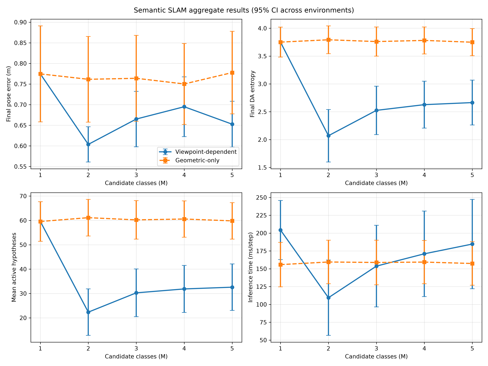
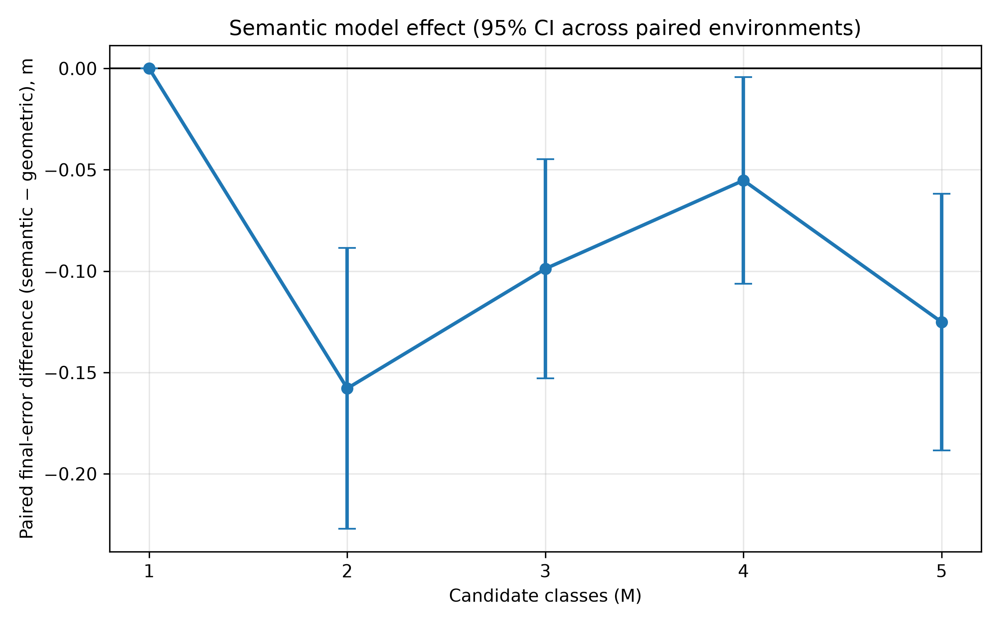
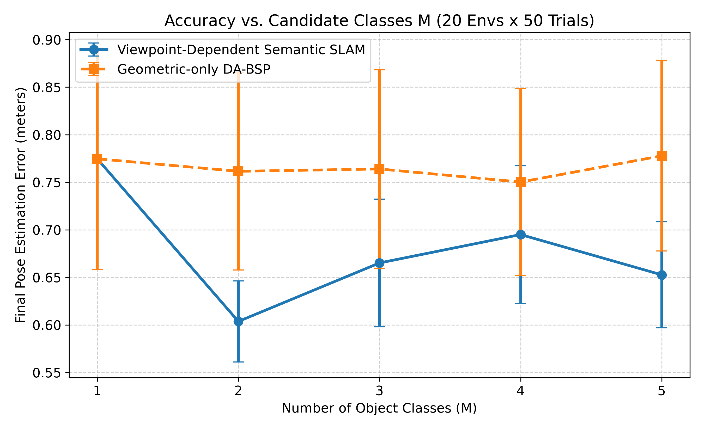
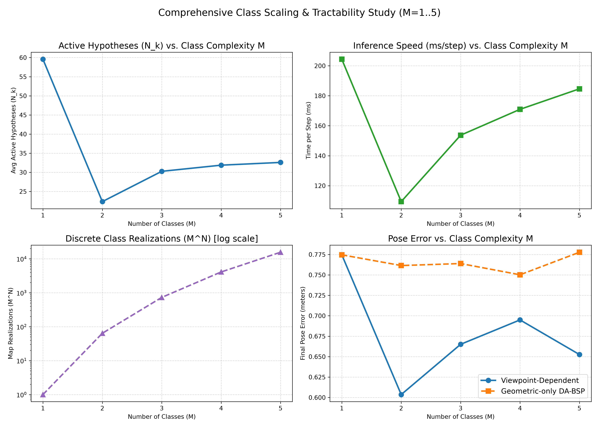
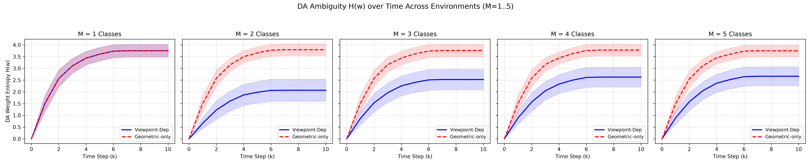
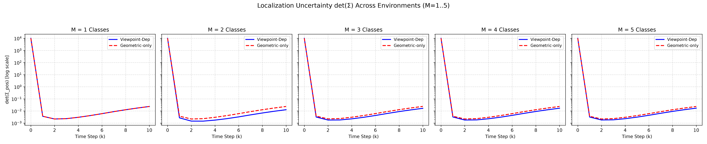

# Vision-Aided Navigation Final Project

This repository implements an EKF-based approximation to *Data Association
Aware Semantic Mapping and Localization via a Viewpoint-Dependent Classifier
Model*. It compares viewpoint-dependent semantic SLAM with the paper's
geometry-only passive DA-BSP baseline while varying the number of candidate
object classes, `M=1..5`.

The corrected v8 study is complete: 20 environments × 50 trials × 5 class
counts × 2 inference modes, or 10,000 trial experiments. All six objects in a
scene share one ground-truth class, but the estimator treats each class as an
independent latent variable. `M=1` is therefore a no-semantic-information
control; `M=2` implements the paper's Equation 18, and `M>2` uses the documented
symmetric extension described below.

## Main results

Final position error is summarized using the mean of each environment as the
independent unit (`n=20`). Values are mean ± normal-approximation 95% CI.

| M | Viewpoint-dependent (m) | Geometric-only (m) | Paired difference (m) | Error reduction |
|---:|---:|---:|---:|---:|
| 1 | 0.7746 ± 0.1164 | 0.7746 ± 0.1164 | +0.0000 ± 0.0000 | 0.0% |
| 2 | 0.6036 ± 0.0426 | 0.7615 ± 0.1038 | −0.1579 ± 0.0693 | 20.7% |
| 3 | 0.6651 ± 0.0672 | 0.7639 ± 0.1042 | −0.0988 ± 0.0540 | 12.9% |
| 4 | 0.6949 ± 0.0724 | 0.7502 ± 0.0982 | −0.0552 ± 0.0510 | 7.4% |
| 5 | 0.6526 ± 0.0557 | 0.7777 ± 0.1001 | −0.1251 ± 0.0632 | 16.1% |

Negative paired differences favor the semantic model. The paired 95% interval
excludes zero for every informative class count (`M=2..5`); the two methods
match exactly for the `M=1` control. Semantics also reduced final DA entropy and
the average number of maintained hypotheses. These results support the
hypothesis that viewpoint-aware semantic evidence resolves association
ambiguity in this synthetic setup. They do not establish performance on real
classifier data.

The slowest recorded trial took 7.783 seconds, well below the five-minute
requirement. Two of the 10,000 trials used the recorded visibility-support
recovery described under Implementation Notes.

## Reproduce the experiment

Create an environment and run the tests:

```bash
python -m venv .venv
.venv/bin/python -m pip install -r requirements.txt
.venv/bin/python -m unittest discover -s tests -v
```

Run the full study:

```bash
MPLBACKEND=Agg MPLCONFIGDIR=/tmp/vision-slam-mpl \
OMP_NUM_THREADS=1 OPENBLAS_NUM_THREADS=1 MKL_NUM_THREADS=1 \
.venv/bin/python -u run_experiments.py \
  --num-environments 20 --trials 50 --steps 10 --num-objects 6 \
  --num-samples 1000 --pruning-ratio 150 --max-hypotheses 100 \
  --workers 2
```

Independent `(mode, trial)` jobs run in worker processes. Start with two to
four workers; memory use grows approximately linearly because every worker owns
its hypothesis trees. Fixed per-trial seeds make the scientific outputs
independent of process scheduling. Limiting BLAS threads avoids nested
oversubscription.

Completed environment/class blocks are cached under `results/data_v8`. Cache
identity includes every result-affecting configuration value and a source-code
fingerprint. A stopped run resumes at the next incomplete `(environment, M)`
block. Outputs from `results/data_v1` through `results/data_v7` are legacy and
must not be combined with v8 results.

## Analyze results

After all 100 checkpoints complete, generate the aggregate CSV, paired analysis,
Markdown report, and summary figures with:

```bash
.venv/bin/python analyze_results.py
```

For the completed dataset copied back from `milkjug`, use:

```bash
.venv/bin/python analyze_results.py \
  --data-dir results/milkjug_full/data_v8 \
  --output-dir results/milkjug_full
```

The local review bundle is in `results/milkjug_full/` and contains:

- all 100 raw v8 JSON checkpoints;
- `RESULTS_ANALYSIS.md` and `aggregate_summary.csv`;
- aggregate, paired-effect, entropy, covariance, tractability, accuracy, and
  trajectory figures; and
- `v8_full_experiment.log`.

Generated results are intentionally gitignored because the raw dataset and
logs are reproducible artifacts rather than source files. The final PNG figures
are committed for direct review on GitHub.

## Figure gallery

### Aggregate results



### Paired semantic effect



### Accuracy and tractability





### Uncertainty over time





### Trajectories

- [M=1 trajectory panel](results/milkjug_full/trajectory_visualization_M1.png)
- [M=2 trajectory panel](results/milkjug_full/trajectory_visualization_M2.png)
- [M=3 trajectory panel](results/milkjug_full/trajectory_visualization_M3.png)
- [M=4 trajectory panel](results/milkjug_full/trajectory_visualization_M4.png)
- [M=5 trajectory panel](results/milkjug_full/trajectory_visualization_M5.png)

To benchmark one production-sized trial for every class count and mode:

```bash
OMP_NUM_THREADS=1 OPENBLAS_NUM_THREADS=1 MKL_NUM_THREADS=1 \
.venv/bin/python benchmark_runtime.py --max-seconds 300
```

## Implementation notes and paper alignment

The engine represents a hybrid belief. Discrete components contain object-class
assignments and data-association histories; each component carries a joint EKF
over the robot and stationary objects. The paper instead uses a per-hypothesis
factor graph with iSAM2, so numerical equivalence should not be claimed.

Within each timestep, associations are injective because the simulator emits
at most one observation per physical object. Unobserved object classes remain
marginalized and are expanded lazily. Components are first pruned by the
paper-style maximum-weight ratio of 150 and then by a documented top-100 beam
cap that bounds runtime.

The viewpoint-dependent mean matches Equation 18 for two classes. For `M>2`,
the Equation 18 error mass is divided uniformly among the other `M−1` classes;
this extension is part of this experiment, not a model specified in the paper.
The baseline uses geometry and visibility only, with no semantic substitute.

The visibility factor is a hard indicator estimated with finite Monte Carlo
samples. If every retained candidate for one observation has zero gated support
but finite geometric/semantic measurement likelihood, the engine falls back to
that measurement likelihood and increments `visibility_recoveries`. This
last-resort path prevents particle-support collapse from aborting a multi-hour
study and is explicitly reported in the results.

See [EXPERIMENT.md](EXPERIMENT.md) for the complete setup, metric definitions,
interpretation, and limitations.
